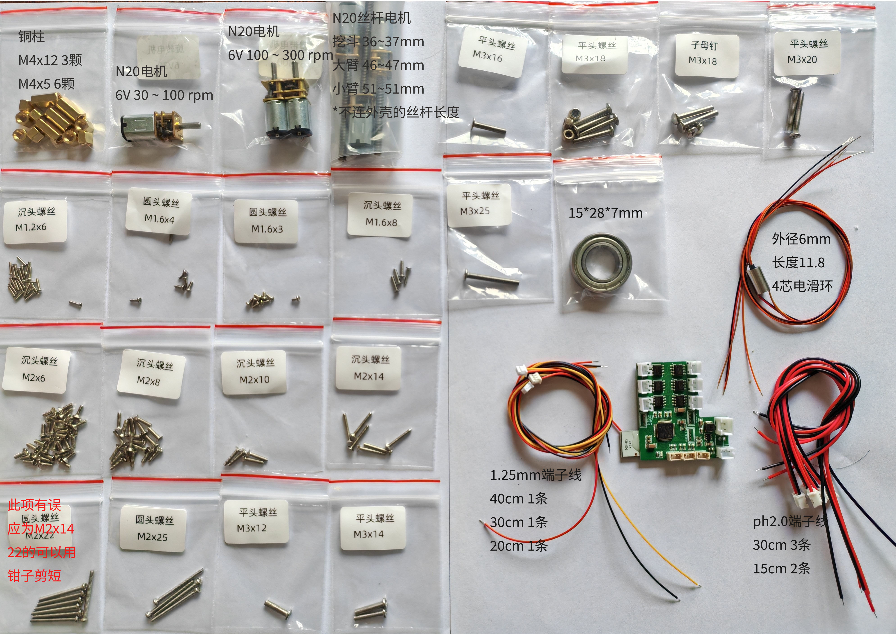
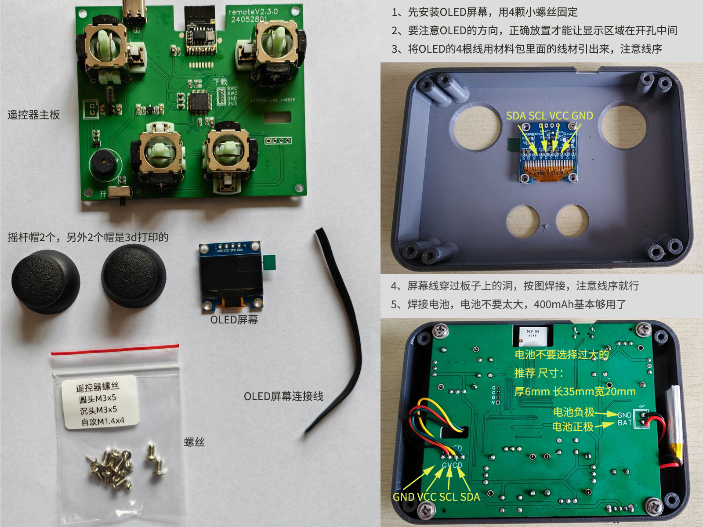
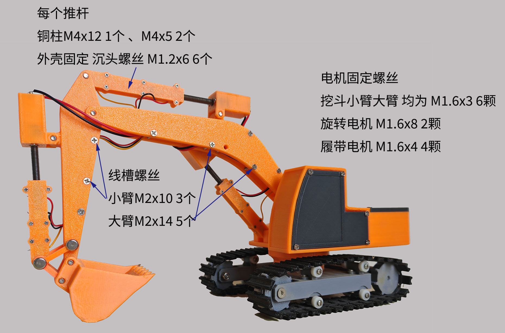
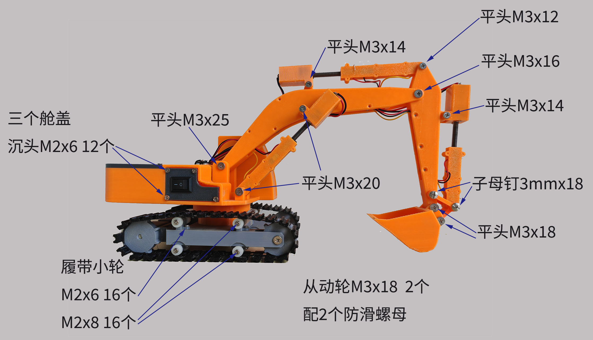
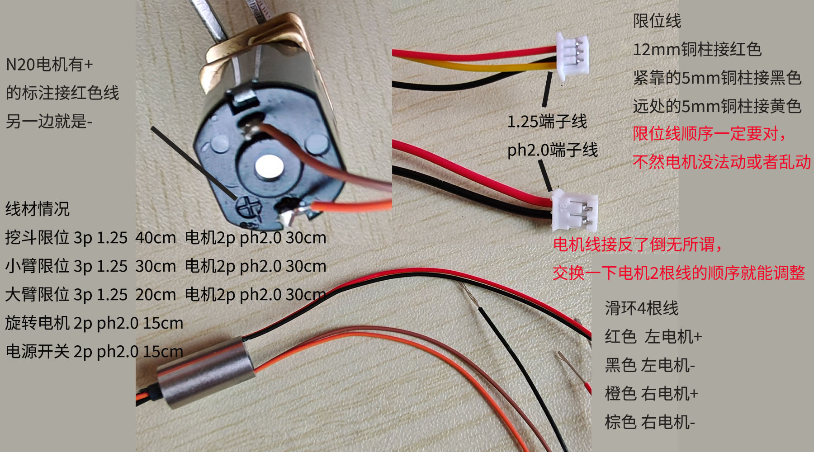

# 3Dprint-mini-RC-excavator-V2

这是一个3d打印结构件，使用通用螺钉、铜柱、电机、等配件制作而成的迷你挖掘机。

## 特点

* 价格便宜、原料易得
* 电推杆力量足，可以挖沙。并且设计有限位保护
* 履带使用TPU打印，缝隙少，在沙子里行驶不易卡住
* 底盘连接使用了电滑环，车身可以无限旋转

## 制作建议：

1、首先打印所有的STL文件，然后购买螺丝等配件
2、PCB使用LCEDA绘制，可以一键打样ＰＣＢ
3、可以手动焊接，也可以使用嘉立创的SMT服务。手焊需要有焊接STM32的经验

